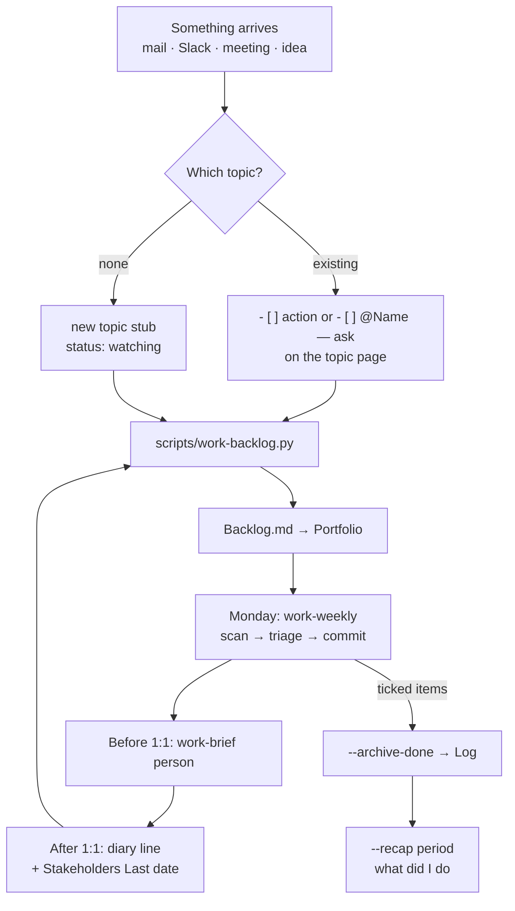

# How To Use Work Planning

The system answers four questions at any time: 
- what am I working on,
- what is next (mine or delegated),
- who is overdue for contact, and
- what did I do last month.

Design and rationale: [[raw/notes/2026-09-18 Plan Work Organisation]]. 
Budget: ≤ 30 min/day on the system.

## What lives where (all in `work/`, never in git)

| File                             | Role                                                                                             | You edit it?                                  |
| -------------------------------- | ------------------------------------------------------------------------------------------------ | --------------------------------------------- |
| `Compass.md`                     | mandate, lever, 90-day outcomes, the out-list                                                    | rarely (November rewrite)                     |
| `Stakeholders.md`                | who needs what, cadence, `Last` contact                                                          | `Last` date after each 1:1                    |
| `Backlog.md`                     | **compiled** — Portfolio + actions + delegated + overdue                                         | never; regenerate                             |
| `Topics.base`                    | table views: Now / All / Overdue review / Watching and parked                                    | no                                            |
| `topics/<Topic>.md`              | one page per large topic: `progress:` sentence, `## Next actions (me)`, `## Delegated`, `## Log` | **yes — this is the only thing you maintain** |
| `weekly/YYYY-Www.md`             | Monday review file, incl. progress snapshot                                                      | produced by the skill                         |
| `briefs/`, `reviews/`, `recaps/` | outputs of the brief, review and recap tools                                                     | no                                            |
| `review-lenses.md`               | your personal review lenses and verdict voice                                                    | *occasionally*                                |

### Daily (≤ 5 min)

1. **Something needs doing** → topic page: add `- [ ] …` under `## Next actions (me)`, or `- [ ] @Name — …` under `## Delegated`.
2. **Something happened** → topic page: one line under `## Log`: `- YYYY-MM-DD — …`.
3. **New subject with no topic** → create a stub in `work/topics/` (copy any existing one), `status: watching`.
4. **Execute** `scripts/work-backlog.py` — regenerates `Backlog.md`.

### Monday (≤ 30 min) — say **"run the weekly review"**

The `work-weekly` skill writes `work/weekly/YYYY-Www.md` and walks through:

- **Scan (≤ 10)** — 
	- new problems, decisions, projects and unmapped notes since last week, each with the topics it touches and a suggested disposition (*new topic / fold into X / watching / ignore*), 
	- dive into at most one.
- **Triage (≤ 15)** — 
	- tick done items (the skill archives them into `## Log` with today's date), 
	- rewrite each active topic's `progress:` sentence, 
	- set `next_review`, 
	- fix `related:` where the interaction check found a gap, 
	- chase delegated items, 
	- update `Last` for stakeholders you spoke to.
- **Commit (≤ 5)** — 
	- pick the week's three chosen-work blocks; each names a topic,
	- read the Portfolio aloud once — if it isn't coherent, fix the topics.

Portfolio cap is ~10 lines: a new topic that wants `active` must displace one.

### Before a 1:1 (≤ 5 min) — say "brief me for person"

`work-brief` writes `work/briefs/YYYY-MM-DD <Person>.md`: five lines (*since last time / what I need from you / risk I see / decision needed / FYI*) plus open asks both ways. Edit, then bring or send it yourself — nothing is sent for you. Afterwards: one line in `raw/diary/`, set the `Last` date in `Stakeholders.md`, add any new `@Name` items on the topic page.

### When someone sends a document or asks an opinion — say **"review this …"** or **"quick take on …"**

`review-doc` runs one reviewer per lens (yours from `review-lenses.md` + defaults) and an adversarial refutation pass, then writes `work/reviews/YYYY-MM-DD <Title>.md` with a verdict draft in your voice. Quick mode answers a Slack-style question in ≤ 10 cited lines with no file. You adjudicate; nothing is sent for you.

## From inside Obsidian

The **Shell commands** plugin is configured (`.obsidian/plugins/obsidian-shellcommands/data.json`). Command palette → type `Work:`:

| Command                               | What it runs                                                                                                |
| ------------------------------------- | ----------------------------------------------------------------------------------------------------------- |
| Work: compile backlog                 | `scripts/work-backlog.py` (result as a notification)                                                        |
| Work: archive done items (today)      | `--archive-done <today>` then recompile                                                                     |
| Work: recap last month                | `--recap last-month` → `work/recaps/`                                                                       |
| Work: weekly review packet            | `work-weekly.py --out work/weekly/packet.md` (dry run; the skill does the real Monday review)               |
| *(automatic)* compile backlog on save | fires on every save of a `work/topics/*.md` file, debounced 2 s, silent — so `Backlog.md` is always current |

Assign a hotkey to *Work: compile backlog* under Settings → Hotkeys if you want one.

## Cheat sheet
![[How To Use Work Planning-1789665226252.jpeg]]

| Want                           | Do                                                                             |
| ------------------------------ | ------------------------------------------------------------------------------ |
| Capture something              | `- [ ] …` or `- [ ] @Name — …` on the topic page → `scripts/work-backlog.py`   |
| "What are you working on?"     | open `work/Backlog.md` → Portfolio                                             |
| Monday                         | "run the weekly review"                                                        |
| Before a 1:1                   | "brief me for Leo"                                                             |
| Doc / opinion request          | "review this …" / "quick take on …"                                            |
| "What did you do in August?"   | `scripts/work-backlog.py --recap 2026-08` (also `2026-W35..W38`, `last-month`) |
| Tick done items outside Monday | `scripts/work-backlog.py --archive-done YYYY-MM-DD`                            |
| Dry-run the Monday packet      | `scripts/work-weekly.py --today YYYY-MM-DD`                                    |
| Dry-run a brief packet         | `scripts/work-brief.py "<person>"`                                             |
| Table view of topics           | open `work/Topics.base`                                                        |
## Workflow



## Topic page frontmatter (reference)

```yaml
type: topic
status: active | watching | parked | done
horizon: now | next | later
lever: throughput | cloud-cost | mandate | none
goal: "[[company goal or principle it serves]]"
stakeholders: ["[[Person]]", "Group"]
progress: "One sentence: where it stands today."
next_review: YYYY-MM-DD
deadline: YYYY-MM-DD        # optional; flagged when < 6 weeks away
related: ["[[Other Topic]]"]
```

## Rules of thumb

- The topic page is the single source of truth; everything else is compiled from it.
- Delegated means a name and a date, or it isn't delegated.
- Done topics get `status: done` — never deleted; they feed the recap.
- Nothing in `work/` or `INBOX/` is ever committed. Scripts and skills are generic by design; keep them so.
